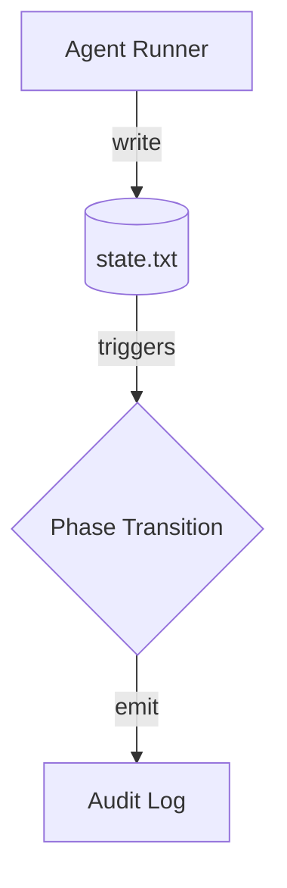

# Technical Reference Document (TRD) — ADR-OS-001: Five-phase operational loop & state management

* **Status:** Draft
* **Owner(s):** Core Engine Team
* **Created:** g74
* **Last Updated:** g74
* **Source ADR:** ADR-OS-001
* **Linked Clarification Record(s):** ADR-OS-001_clarification.md
* **Trace ID:** trace://trd-001/g74
* **Vector Clock:** vc://trd@74:0

---

## 1. Executive Summary
This TRD specifies how the five operational phases (ANALYZE → BLUEPRINT → CONSTRUCT → VALIDATE → IDLE) are implemented in code, governed by `os_root/state.txt` and enforced idempotently.

## 2. Normative Requirements
| # | Requirement | Criticality |
|---|-------------|-------------|
| R1 | The OS **MUST** persist `state.txt` atomically between phases. | MUST |
| R2 | Every phase transition **MUST** emit an immutable audit-trail entry (ADR-OS-029). | MUST |
| R3 | Agents **SHOULD** retry failed `state.txt` writes with exponential back-off and idempotency key. | SHOULD |

## 3. Architecture Overview

## 4. Implementation Guidelines
- Use `atomic_io.atomic_write()` helper for all state writes.
- Guard each transition with vector-clock comparison.

## 5. Test Strategy
- Unit-test happy-path transition per phase.
- Chaos test: inject write failure; verify retry & idempotency.

## 6. SLIs / SLOs
- `phase_transition_latency_seconds` p95 < 1.0s.
- `state_write_errors_total` == 0.

## 7. Open Issues & Future Work
- Move `state.txt` to consensus log in Phase 3.

## 8. Traceability
- adr_source: ADR-OS-001
- clarification_source: ADR-OS-001_clarification.md
- trace_id: trace://trd-001/g74
- vector_clock: vc://trd@74:0
- g_document_created: 74
- g_document_last_updated: 74

---
Distributed-Systems Protocol Compliance Checklist
- [x] Idempotent updates supported
- [x] Message-driven integration points documented
- [ ] Immutable audit-trail hooks attached 