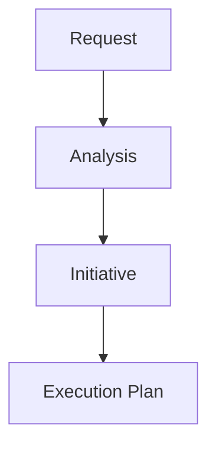

# Technical Reference Document (TRD) — ADR-OS-002: Hierarchical Planning Store Lineage Guarantees

* **Status:** Draft
* **Owner(s):** Planning Subsystem Team
* **Created:** g74
* **Last Updated:** g74
* **Source ADR:** ADR-OS-002
* **Linked Clarification Record(s):** ADR-OS-002_clarification.md
* **Trace ID:** trace://trd-002/g74
* **Vector Clock:** vc://trd@74:1

---

## 1. Executive Summary
Defines the four-tier Request → Analysis → Initiative → Execution hierarchy and the invariants that guarantee immutable lineage and idempotent linkage creation.

## 2. Normative Requirements
| # | Requirement | Criticality |
|---|-------------|-------------|
| R1 | Each planning artifact **MUST** include an immutable `parent_id`. | MUST |
| R2 | Link creation **MUST** be idempotent and validated by the Supervisor Agent. | MUST |
| R3 | Orphan detection job **SHOULD** repair lineage within 10 minutes. | SHOULD |

## 3. Architecture Overview

## 4. Implementation Guidelines
- Enforce `writeOnce: true` for `parent_id` in schema.
- Child creation event carries `(lamport, vc)` tuple.

## 5. Test Strategy
- Unit tests for writeOnce violation.
- Integration test for orphan auto-repair cron.

## 6. SLIs / SLOs
- `linkage_latency_seconds` p95 < 60s.

## 7. Open Issues
- Dynamic quorum algorithm for small clusters.

## 8. Traceability
- adr_source: ADR-OS-002
- clarification_source: ADR-OS-002_clarification.md
- trace_id: trace://trd-002/g74
- vector_clock: vc://trd@74:1
- g_document_created: 74
- g_document_last_updated: 74

---
Distributed-Systems Protocol Compliance Checklist
- [x] Idempotent updates supported
- [x] Message-driven integration points documented
- [ ] Immutable audit-trail hooks attached 