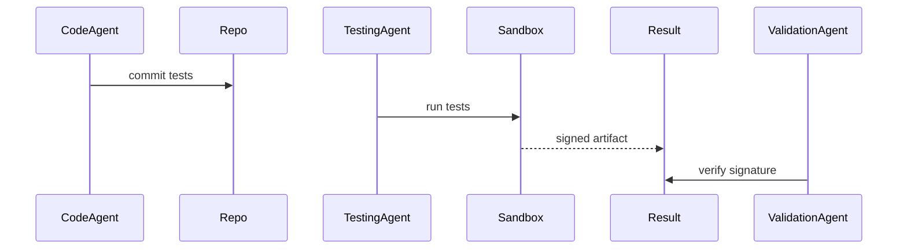

# TRD — ADR-OS-007: Evidence-Based Testing Lifecycle

* **Status:** Draft
* **Owner(s):** QA & Validation Team
* **Created:** g74
* **Source ADR:** ADR-OS-007
* **Clarification:** ADR-OS-007_clarification.md
* **Trace ID:** trace://trd-007/g74
* **Vector Clock:** vc://trd@74:6

---

## Executive Summary
Segregates duties among Coding Agent, Testing Agent (sandboxed), and Validation Agent, producing signed, immutable test result artifacts.

## Normative Requirements
| Req | Statement |
|-----|-----------|
| R1 | Test results **MUST** be cryptographically signed (Sigstore/cosign or offline HSM). |
| R2 | Flaky tests (<70% pass rate EWMA) **MUST** be quarantined. |
| R3 | Destructive tests **SHALL** run only in disposable namespaces. |

## Architecture Overview

## Implementation Guidelines
- Use `haios-sign-offline` for air-gapped mode.
- Retain last 200 success results; compress failures.

## Test Strategy
- Signature interoperability test.
- EWMA flake score unit test.

## SLIs
- `signed_result_verification_failure_total` == 0.

## Traceability
- adr_source: ADR-OS-007
- clarification_source: ADR-OS-007_clarification.md
- trace_id: trace://trd-007/g74
- vector_clock: vc://trd@74:6
- g_created: 74 