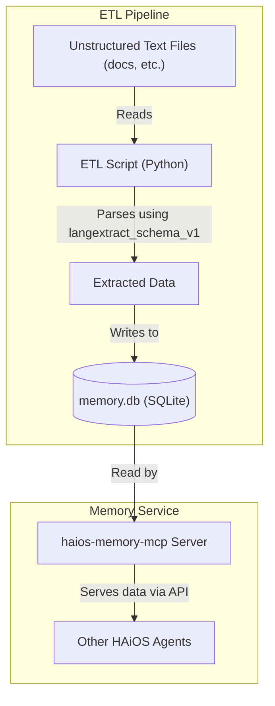

# generated: 2025-12-05
# System Auto: last updated on: 2025-12-05 20:54:18
# Technical Reference Document (TRD) — ETL-v1: Agent Memory ETL

> **⚠️ SUPERSEDED:** This document has been superseded by [TRD-ETL-v2.md](TRD-ETL-v2.md).
> Retained for historical reference only. See TRD-ETL-v2 for current specifications.

* **Status:** `SUPERSEDED`
*   **Superseded By:** [TRD-ETL-v2.md](TRD-ETL-v2.md)
*   **Owner(s):** Genesis Architect
*   **Created:** 2025-10-18
*   **Last Updated:** 2025-12-05 (marked as superseded)
*   **Source ADR:** (N/A for this mission)
*   **Linked Clarification Record(s):** (N/A)
*   **Trace ID:** trd-etl-v1

---

## 1. Executive Summary

This document provides the technical specifications for the "ETL Agent Memory" mission. The goal is to extract structured information from the project's unstructured text-based artifacts and load it into a queryable SQLite database. This will serve as the foundational memory layer for all HAiOS agents.

## 2. Normative Requirements

| #  | Requirement                                                                                             | Criticality |
| -- | ------------------------------------------------------------------------------------------------------- | ----------- |
| R1 | The ETL pipeline **MUST** parse text files to extract entities and concepts defined in `langextract_schema_v1.yml`. | MUST        |
| R2 | The extracted data **MUST** be stored in a SQLite database adhering to the `memory_db_schema_v1.sql` schema. | MUST        |
| R3 | A new MCP server, `haios-memory-mcp`, **MUST** be created to expose the memory data.                      | MUST        |
| R4 | The MCP server **MUST** implement the API defined in `haios_memory_mcp_api_v1.md`.                        | MUST        |
| R5 | The implementation **SHOULD** be done in Python.                                                          | SHOULD      |

## 3. Architecture Overview

The architecture consists of a Python-based ETL pipeline and a new MCP server.



## 4. Implementation Guidelines

This section provides the detailed specifications required for implementation. As the `langextract` library is not part of the core model dataset, these references are explicit and self-contained to ensure durable context for the builder agent.

### 4.1 Core Tool: `langextract` Library

The implementation **MUST** use the `langextract` Python library to perform the extraction.

*   **Evidence:** The existence and API of this library were verified by observing the `langextract-repomix-output.xml` file provided by the operator.
*   **Primary Entry Point:** The core function for the pipeline is `langextract.extract()`.
    *   **Reference:** See `langextract/extraction.py` in the `repomix` file for the full function signature.
*   **Key Data Structures:** The builder agent must use the following data classes for interacting with the library:
    *   `langextract.data.ExampleData`: To construct the few-shot examples that guide the model.
    *   `langextract.data.Extraction`: The structured output object returned by the library for each found entity or concept.
    *   **Reference:** The definitions for these classes are in `langextract/core/data.py` in the `repomix` file.
*   **Usage Pattern:** The script must follow this general pattern:
    ```python
    import langextract as lx

    # 1. Translate the YAML schema into a list of ExampleData objects.
    examples = [lx.data.ExampleData(...)]

    # 2. Call the main extraction function.
    result = lx.extract(
        text_or_documents="The text to be analyzed...",
        prompt_description="A prompt describing the task...",
        examples=examples,
        model_id="gemini-1.5-pro-latest" # Or other configured model
    )

    # 3. Process the results.
    for extraction in result.extractions:
        # `extraction` is an lx.data.Extraction object.
        # Load this object into the SQLite database.
        print(f"Found: {extraction.extraction_class} -> {extraction.extraction_text}")
    ```

### 4.2 Extraction Schema (`langextract_schema_v1.yml`)

The ETL pipeline **MUST** extract entities and concepts according to the following YAML schema. This schema defines the `extraction_class` for each item and is the source of truth for generating the `ExampleData` objects.

```yaml
# langextract_schema_v1.yml
# A lean, focused schema for the initial ETL process (v1).
# The goal is to capture only the most fundamental conversational and architectural elements.

# 1. Core Entities
entities:
  - name: "User"
    # Matches the speaker role for the human operator.
    pattern: "(?i)(user|human|operator):"
  - name: "Agent"
    # Matches the speaker role for the AI.
    pattern: "(?i)(cody|gemini|claude|agent):"
  - name: "ADR"
    # Matches references to our core architectural artifacts.
    pattern: "ADR-OS-\\\d{3}"
  - name: "Filepath"
    # Matches references to files, grounding the conversation.
    pattern: "[\\w/\\\\\\.]+\\.(py|md|json|yml|sh|bat|txt)"
  - name: "AntiPattern"
    # Matches references to our defined anti-patterns.
    pattern: "AP-\\\d{3}"

# 2. Core Concepts
concepts:
  - name: "Directive"
    # A user giving a direct command or instruction.
    pattern: "(?i)(user says:|directive:|your task is to)"
    examples:
      - "user says: generate the full remediated file"
  - name: "Critique"
    # A user or agent providing corrective feedback or identifying a flaw.
    pattern: "(?i)(no,|nah,|that\'s wrong|you failed|the flaw is|the weakness is|the problem is)"
    examples:
      - "user says: no, the path is wrong"
      - "The flaw is that the logic lives in the n8n database"
  - name: "Proposal"
    # An agent proposing a plan, solution, or next step.
    pattern: "(?i)(i propose|the plan is|my recommendation is|the solution is|we should)"
    examples:
      - "agent says: I propose a new execution plan"
      - "My recommendation is to implement a Decoupled Adapter Pattern"
  - name: "Decision"
    # A formal decision being made.
    pattern: "(?i)decision:"
    examples:
      - "Decision: ADOPT AND CANONIZE THIS POLICY."
```

### 4.3 Database Schema (`memory_db_schema_v1.sql`)

The extracted data **MUST** be stored in a SQLite database named `memory.db` with the following schema. The `entities` and `concepts` tables will be populated from the `Extraction` objects.

```sql
-- memory_db_schema_v1.sql
-- A simple schema for the agent memory database (v1).

-- Table to store information about the source artifacts (files).
CREATE TABLE artifacts (
    id INTEGER PRIMARY KEY AUTOINCREMENT,
    file_path TEXT NOT NULL UNIQUE,
    last_processed_at DATETIME DEFAULT CURRENT_TIMESTAMP
);

-- Table to store the extracted entities.
CREATE TABLE entities (
    id INTEGER PRIMARY KEY AUTOINCREMENT,
    type TEXT NOT NULL, -- e.g., \'User\', \'Agent\', \'ADR\'
    value TEXT NOT NULL,
    UNIQUE(type, value)
);

-- Table to store occurrences of entities within artifacts.
CREATE TABLE entity_occurrences (
    id INTEGER PRIMARY KEY AUTOINCREMENT,
    artifact_id INTEGER NOT NULL,
    entity_id INTEGER NOT NULL,
    line_number INTEGER,
    context_snippet TEXT,
    FOREIGN KEY (artifact_id) REFERENCES artifacts (id),
    FOREIGN KEY (entity_id) REFERENCES entities (id)
);

-- Table to store the extracted concepts.
CREATE TABLE concepts (
    id INTEGER PRIMARY KEY AUTOINCREMENT,
    type TEXT NOT NULL, -- e.g., \'Directive\', \'Proposal\', \'Critique\'
    content TEXT NOT NULL,
    source_adr TEXT -- For \'Decision\' concepts
);

-- Table to store occurrences of concepts within artifacts.
CREATE TABLE concept_occurrences (
    id INTEGER PRIMARY KEY AUTOINCREMENT,
    artifact_id INTEGER NOT NULL,
    concept_id INTEGER NOT NULL,
    line_number INTEGER,
    context_snippet TEXT,
    FOREIGN KEY (artifact_id) REFERENCES artifacts (id),
    FOREIGN KEY (concept_id) REFERENCES concepts (id)
);

-- Indexes for faster queries.
CREATE INDEX idx_entities_type_value ON entities (type, value);
CREATE INDEX idx_entity_occurrences_artifact_id ON entity_occurrences (artifact_id);
CREATE INDEX idx_concept_occurrences_artifact_id ON concept_occurrences (artifact_id);
```

### 4.4 API Specification (`haios_memory_mcp_api_v1.md`)

The `haios-memory-mcp` server **MUST** implement the following JSON-RPC API to provide agent access to the `memory.db`.

#### **Method 1: `memory.search`**
This is the primary workhorse method. It allows for a flexible search across the memory, combining keyword/semantic search with structured filters based on the entities and concepts we\'ve extracted.

**Request Example:**
```json
{
  "jsonrpc": "2.0",
  "method": "memory.search",
  "params": {
    "query": "What is the \'Certainty Ratchet\'?",
    "entity_filter": [
      {"type": "ADR", "value": "ADR-OS-043"}
    ],
    "concept_filter": [
      {"type": "Principle"}
    ],
    "limit": 10
  },
  "id": 1
}
```

#### **Method 2: `memory.getArtifactDetails`**
A simpler method to retrieve all known structured information about a single, specific file.

**Request Example:**
```json
{
  "jsonrpc": "2.0",
  "method": "memory.getArtifactDetails",
  "params": {
    "file_path": "docs/ADR/ADR-OS-043.md"
  },
  "id": 2
}
```

## 5. Test Strategy

*   **Unit Tests:**
    *   Test the ETL script's regex patterns against a variety of sample text snippets.
    *   Test the database insertion logic.
*   **Integration Tests:**
    *   Test the full ETL pipeline on a small set of sample documents.
    *   Test the MCP server's API endpoints with mock requests and verify the responses.

## 6. Open Issues & Future Work

*   The `langextract` schema will need to be expanded in `v2` to capture more nuanced concepts.
*   The `memory.search` API method will need to be enhanced with vector search capabilities in a future version.

---
