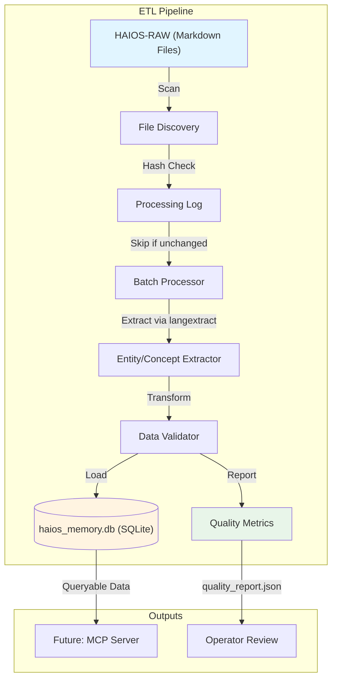

# generated: 2025-10-19
# System Auto: last updated on: 2026-02-01T21:30:03
# Technical Reference Document (TRD) - ETL-v2: Agent Memory ETL Pipeline

> **Progressive Disclosure:** [Quick Reference](../README.md) -> [Current Epoch](../../.claude/haios/epochs/E2_4/EPOCH.md) -> [Specs](.) -> **TRD-ETL-v2 (YOU ARE HERE)**
>
> **Navigation:** [Schema v3](memory_db_schema_v3.sql) | [Synthesis TRD](TRD-SYNTHESIS-EXPLORATION.md) | [Operations](../OPERATIONS.md)

---

* **Status:** `APPROVED`
* **Owner(s):** Genesis Architect
* **Created:** 2025-10-18
* **Last Updated:** 2025-10-19
* **Version:** v2 (supersedes v1)
* **Source ADR:** (N/A for this mission)
* **Linked Clarification Record(s):** (N/A)
* **Trace ID:** trd-etl-v2

---
n## Table of Contents

1. [Executive Summary](#1-executive-summary)
2. [Normative Requirements](#2-normative-requirements)
3. [Architecture Overview](#3-architecture-overview)
4. [Implementation Guidelines](#4-implementation-guidelines)
   - [4.1 Core Tool: `langextract` Library](#41-core-tool-langextract-library)
   - [4.2 Extraction Schema](#42-extraction-schema-langextract_schema_v1yml)
   - [4.3 Database Schema](#43-database-schema-memory_db_schema_v3sql)
   - [4.4 Batch Processing and Resilience](#44-batch-processing-and-resilience)
   - [4.5 Data Quality and Validation](#45-data-quality-and-validation)
   - [4.6 Error Handling Requirements](#46-error-handling-requirements)
   - [4.7 File Format Handling & Preprocessing](#47-file-format-handling--preprocessing)
   - [4.8 Performance Requirements](#48-performance-requirements)
5. [Test Strategy](#5-test-strategy)
   - [5.1 Unit Tests](#51-unit-tests)
   - [5.2 Integration Tests](#52-integration-tests)
   - [5.3 Performance Tests](#53-performance-tests)
   - [5.4 Acceptance Criteria](#54-acceptance-criteria-phase-1-complete)
6. [Command-Line Interface](#6-command-line-interface)
7. [Open Issues & Future Work](#7-open-issues--future-work)
8. [References](#8-references)


## 1. Executive Summary

This document provides the technical specifications for the "ETL Agent Memory" mission. The goal is to extract structured information from the project's unstructured text-based artifacts (HAIOS-RAW) and load it into a queryable SQLite database. This will serve as the foundational memory layer for all HAiOS agents.

**Key Changes from v1:**
- Removed MCP server from scope (deferred to separate TRD)
- Added batch processing with checkpoint/resume capability
- Added data quality framework and reporting
- Added idempotency with file hash-based change detection
- Added comprehensive error handling requirements
- Added performance requirements and concrete test acceptance criteria

---

## 2. Normative Requirements

| #  | Requirement                                                                                             | Criticality |
| -- | ------------------------------------------------------------------------------------------------------- | ----------- |
| R0 | This TRD covers ONLY the ETL pipeline. The MCP server is OUT OF SCOPE (deferred to TRD-MCP-Memory-v1). | MUST        |
| R1 | The ETL pipeline MUST parse text files to extract entities and concepts defined in `langextract_schema_v1.yml` AND produce a quality report for each processing run. | MUST        |
| R2 | The extracted data MUST be stored in a SQLite database adhering to the `memory_db_schema_v3.sql` schema. | MUST        |
| R3 | The ETL pipeline MUST process files in batches with progress tracking and resume capability. | MUST        |
| R4 | The ETL pipeline MUST calculate file hashes and skip unchanged files (idempotency). | MUST        |
| R5 | The ETL pipeline MUST generate a quality report after each processing run. | MUST        |
| R6 | The ETL pipeline MUST handle errors gracefully and log all failures. | MUST        |
| R7 | The ETL pipeline MUST meet performance requirements (avg <5s per file, <512MB memory). | SHOULD      |
| R8 | The implementation SHOULD be done in Python. | SHOULD      |

---

## 3. Architecture Overview

The architecture consists of a Python-based ETL pipeline that processes unstructured markdown files and loads structured data into SQLite.



---

## 4. Implementation Guidelines

This section provides the detailed specifications required for implementation. As the `langextract` library is not part of the core model dataset, these references are explicit and self-contained to ensure durable context for the builder agent.

### 4.1 Core Tool: `langextract` Library

The implementation **MUST** use the `langextract` Python library to perform the extraction.

*   **Evidence:** The existence and API of this library were verified by observing the `langextract-repomix-output.xml` file provided by the operator.
*   **Primary Entry Point:** The core function for the pipeline is `langextract.extract()`.
    *   **Reference:** See `langextract/extraction.py` in the `repomix` file for the full function signature.
*   **Key Data Structures:** The builder agent must use the following data classes for interacting with the library:
    *   `langextract.data.ExampleData`: To construct the few-shot examples that guide the model.
    *   `langextract.data.Extraction`: The structured output object returned by the library for each found entity or concept.
    *   **Reference:** The definitions for these classes are in `langextract/core/data.py` in the `repomix` file.
*   **Usage Pattern:** The script must follow this general pattern:
    ```python
    import langextract as lx

    # 1. Translate the YAML schema into a list of ExampleData objects.
    examples = [lx.data.ExampleData(...)]

    # 2. Call the main extraction function with optimizations.
    result = lx.extract(
        text_or_documents="The text to be analyzed...",
        prompt_description="A prompt describing the task...",
        examples=examples,
        model_id="gemini-2.5-flash",  # Use latest recommended model
        use_schema_constraints=True,   # Enforce structure
        extraction_passes=3,            # Multiple passes for better recall
        max_workers=20,                 # Parallel processing
        max_char_buffer=1000            # Smaller contexts for accuracy
    )

    # 3. Process the results.
    for extraction in result.extractions:
        # `extraction` is an lx.data.Extraction object.
        # Load this object into the SQLite database.
        print(f"Found: {extraction.extraction_class} -> {extraction.extraction_text}")
    ```

### 4.2 Extraction Schema (`langextract_schema_v1.yml`)

The ETL pipeline **MUST** extract entities and concepts according to the following YAML schema. This schema defines the `extraction_class` for each item and is the source of truth for generating the `ExampleData` objects.

```yaml
# langextract_schema_v1.yml
# A lean, focused schema for the initial ETL process (v1).
# The goal is to capture only the most fundamental conversational and architectural elements.

# 1. Core Entities
entities:
  - name: "User"
    # Matches the speaker role for the human operator.
    pattern: "(?i)(user|human|operator):"
  - name: "Agent"
    # Matches the speaker role for the AI.
    pattern: "(?i)(cody|gemini|claude|agent):"
  - name: "ADR"
    # Matches references to our core architectural artifacts.
    pattern: "ADR-OS-\\d{3}"
  - name: "Filepath"
    # Matches references to files, grounding the conversation.
    pattern: "[\\w/\\\\\\.]+\\.(py|md|json|yml|sh|bat|txt)"
  - name: "AntiPattern"
    # Matches references to our defined anti-patterns.
    pattern: "AP-\\d{3}"

# 2. Core Concepts
concepts:
  - name: "Directive"
    # A user giving a direct command or instruction.
    pattern: "(?i)(user says:|directive:|your task is to)"
    examples:
      - "user says: generate the full remediated file"
  - name: "Critique"
    # A user or agent providing corrective feedback or identifying a flaw.
    pattern: "(?i)(no,|nah,|that's wrong|you failed|the flaw is|the weakness is|the problem is)"
    examples:
      - "user says: no, the path is wrong"
      - "The flaw is that the logic lives in the n8n database"
  - name: "Proposal"
    # An agent proposing a plan, solution, or next step.
    pattern: "(?i)(i propose|the plan is|my recommendation is|the solution is|we should)"
    examples:
      - "agent says: I propose a new execution plan"
      - "My recommendation is to implement a Decoupled Adapter Pattern"
  - name: "Decision"
    # A formal decision being made.
    pattern: "(?i)decision:"
    examples:
      - "Decision: ADOPT AND CANONIZE THIS POLICY."
```

### 4.3 Database Schema (`memory_db_schema_v3.sql`)

**AUTHORITATIVE SCHEMA:** See `docs/specs/memory_db_schema_v3.sql` (per DD-010).

The extracted data **MUST** be stored in a SQLite database named `haios_memory.db`. The schema below is a historical reference from when this TRD was created (Oct 2025). The current production schema has evolved beyond this.

**Schema Evolution (v2 → v3 - DD-010):**
- Added `embeddings` table with `concept_id` foreign key for vector search
- Enhanced entity/concept schema with additional metadata fields
- Added `space_id` column for multi-space memory partitioning

**Historical Changes (v1 → v2):**
- Added `file_hash` to `artifacts` table for change detection
- Added `version` to `artifacts` table for tracking re-processing
- Added `processing_log` table for batch processing and resume capability
- Added `quality_metrics` table for data quality tracking

```sql
-- memory_db_schema_v3.sql
-- Enhanced schema for the agent memory database (v2).

-- Table to store information about the source artifacts (files).
CREATE TABLE artifacts (
    id INTEGER PRIMARY KEY AUTOINCREMENT,
    file_path TEXT NOT NULL UNIQUE,
    file_hash TEXT NOT NULL,                    -- SHA256 hash for change detection
    last_processed_at DATETIME DEFAULT CURRENT_TIMESTAMP,
    version INTEGER DEFAULT 1                   -- Increment on re-processing
);

-- Table to store the extracted entities.
CREATE TABLE entities (
    id INTEGER PRIMARY KEY AUTOINCREMENT,
    type TEXT NOT NULL,                         -- e.g., 'User', 'Agent', 'ADR'
    value TEXT NOT NULL,
    UNIQUE(type, value)
);

-- Table to store occurrences of entities within artifacts.
CREATE TABLE entity_occurrences (
    id INTEGER PRIMARY KEY AUTOINCREMENT,
    artifact_id INTEGER NOT NULL,
    entity_id INTEGER NOT NULL,
    line_number INTEGER,
    context_snippet TEXT,
    FOREIGN KEY (artifact_id) REFERENCES artifacts (id),
    FOREIGN KEY (entity_id) REFERENCES entities (id)
);

-- Table to store the extracted concepts.
CREATE TABLE concepts (
    id INTEGER PRIMARY KEY AUTOINCREMENT,
    type TEXT NOT NULL,                         -- e.g., 'Directive', 'Proposal', 'Critique'
    content TEXT NOT NULL,
    source_adr TEXT                             -- For 'Decision' concepts
);

-- Table to store occurrences of concepts within artifacts.
CREATE TABLE concept_occurrences (
    id INTEGER PRIMARY KEY AUTOINCREMENT,
    artifact_id INTEGER NOT NULL,
    concept_id INTEGER NOT NULL,
    line_number INTEGER,
    context_snippet TEXT,
    FOREIGN KEY (artifact_id) REFERENCES artifacts (id),
    FOREIGN KEY (concept_id) REFERENCES concepts (id)
);

-- Table to track processing status for batch processing and resume capability.
CREATE TABLE processing_log (
    id INTEGER PRIMARY KEY AUTOINCREMENT,
    file_path TEXT NOT NULL UNIQUE,
    status TEXT NOT NULL CHECK(status IN ('pending', 'success', 'error', 'skipped')),
    attempt_count INTEGER DEFAULT 0,
    last_attempt_at DATETIME DEFAULT CURRENT_TIMESTAMP,
    error_message TEXT,
    file_hash TEXT                              -- SHA256 hash for change detection
);

-- Table to store quality metrics for each processed file.
CREATE TABLE quality_metrics (
    id INTEGER PRIMARY KEY AUTOINCREMENT,
    artifact_id INTEGER NOT NULL,
    entities_extracted INTEGER DEFAULT 0,
    concepts_extracted INTEGER DEFAULT 0,
    processing_time_seconds REAL,
    llm_tokens_used INTEGER,
    created_at DATETIME DEFAULT CURRENT_TIMESTAMP,
    FOREIGN KEY (artifact_id) REFERENCES artifacts (id)
);

-- Indexes for faster queries.
CREATE INDEX idx_entities_type_value ON entities (type, value);
CREATE INDEX idx_entity_occurrences_artifact_id ON entity_occurrences (artifact_id);
CREATE INDEX idx_concept_occurrences_artifact_id ON concept_occurrences (artifact_id);
CREATE INDEX idx_processing_log_status ON processing_log (status);
CREATE INDEX idx_artifacts_file_hash ON artifacts (file_hash);
```

### 4.4 Batch Processing and Resilience

The ETL pipeline MUST implement the following batch processing capabilities to handle large corpora (2M+ tokens) reliably:

**4.4.1 Chunked Processing**
- Process files in configurable batches (default: 50 files per batch)
- Commit database transactions after each batch (not per-file) for performance

**4.4.2 Progress Tracking**
- Maintain a `processing_log` table to track which files have been processed
- Record: file_path, processing_status (pending|success|error|skipped), timestamp, error_message

**4.4.3 Resume Capability**
- On pipeline restart, skip files marked as "success" in processing_log
- Retry files marked as "error" up to N times (default: 3 attempts)
- Configurable via command-line argument: `--max-retries=3`

**4.4.4 Rate Limiting**
- Implement exponential backoff for API rate limit errors (HTTP 429 responses)
- Formula: `wait_time = min(2^attempt_count, 60)` seconds
- Configurable requests-per-minute limit (default: 60 RPM)
- Command-line argument: `--rate-limit=60`

**4.4.5 Memory Management**
- Process files sequentially, not all loaded in memory
- Maximum memory usage: 512MB
- Use streaming reads for files >1MB

**4.4.6 Idempotency with File Hashing**
Before processing a file:
1. Calculate SHA256 hash of file contents
2. Check if hash matches existing record in `artifacts` table
3. If hash matches: Skip processing (file unchanged), mark as "skipped" in processing_log
4. If no match or new file: Process and insert/update with new hash

### 4.5 Data Quality and Validation

The ETL pipeline MUST produce quality metrics and validation reports to ensure data integrity.

**4.5.1 Quality Metrics per File**
Track and store in `quality_metrics` table:
- Total entities extracted (by type)
- Total concepts extracted (by type)
- Processing time (seconds)
- LLM token usage (if available from langextract)

**4.5.2 Quality Rules**
- Files with zero extractions MUST be logged as warnings in quality_report.json
- Files taking >60 seconds MUST be flagged for review
- LLM errors MUST be captured in processing_log.error_message

**4.5.3 Quality Report Output**
Generate `quality_report.json` after each processing run:

```json
{
  "run_id": "uuid-v4",
  "started_at": "2025-10-19T15:00:00Z",
  "completed_at": "2025-10-19T16:30:00Z",
  "files_processed": 1234,
  "files_success": 1200,
  "files_error": 34,
  "files_skipped": 500,
  "total_entities": 45678,
  "total_concepts": 12345,
  "entity_breakdown": {
    "User": 5000,
    "Agent": 4800,
    "ADR": 1200,
    "Filepath": 30000,
    "AntiPattern": 78
  },
  "concept_breakdown": {
    "Directive": 3000,
    "Critique": 2000,
    "Proposal": 5000,
    "Decision": 345
  },
  "warnings": [
    {"file": "path/to/empty.md", "issue": "zero_extractions"},
    {"file": "path/to/slow.md", "issue": "processing_time_exceeded", "time_seconds": 75}
  ],
  "errors": [
    {"file": "path/to/broken.md", "issue": "llm_timeout", "attempts": 3}
  ]
}
```

### 4.6 Error Handling Requirements

The ETL pipeline MUST handle the following error scenarios gracefully:

**4.6.1 LangExtract API Errors**
- **Rate limit (HTTP 429):** Exponential backoff, retry up to 3 times
- **Timeout:** Log error, mark file as "error" in processing_log, continue to next file
- **Invalid response:** Log raw response to error log, mark file as "error"

**4.6.2 File System Errors**
- **File not found:** Log warning, skip file, mark as "skipped"
- **Permission denied:** Log error, mark file as "skipped"
- **Encoding errors:** Try UTF-8, then fallback to latin-1, then mark as "error"

**4.6.3 Database Errors**
- **Constraint violation:** Log error, rollback transaction, continue processing
- **Disk full:** Stop processing immediately, alert operator (exit with error code 1)
- **Lock timeout:** Retry up to 3 times with 1-second delay

**4.6.4 Malformed Documents**
- **Empty files (0 bytes):** Log warning, insert artifact record with zero extractions
- **Binary files:** Skip with warning (check file extension against allowed list)
- **Files >10MB:** Log warning, process anyway (may be slow)

**4.6.5 Error Logging Format**
All errors MUST be logged to `etl_errors.log` in JSON format for structured analysis:

```json
{
  "timestamp": "2025-10-19T15:30:45Z",
  "level": "ERROR",
  "file_path": "HAIOS-RAW/docs/example.md",
  "error_type": "LLM_TIMEOUT",
  "error_message": "Request timeout after 60s",
  "retry_count": 2,
  "stack_trace": "..."
}
```

### 4.7 File Format Handling & Preprocessing

**Input Assumption:** The pipeline is designed for unstructured text files, primarily markdown (`.md`).

**Non-Standard Formats:** Files that cannot be processed as plain text (e.g., malformed JSON, proprietary formats) MUST be preprocessed into text format before extraction.

**Preprocessor Architecture:**
- Preprocessors are format-specific transformers located in `haios_etl/preprocessors/`
- Each preprocessor implements the base interface defined in `preprocessors/base.py`
- Preprocessors run automatically before extraction when file markers are detected
- Transformed content is passed to the standard extraction pipeline

**Current Preprocessors:**
- `gemini_dump.py`: Transforms Gemini API session dumps (detected by `"runSettings"` and `"chunkedPrompt"` markers) into plain text by extracting all text field values using regex pattern matching.

**Design Rationale:** Separating format transformation from extraction logic maintains single responsibility, enables extensibility for future formats, and keeps the extraction pipeline clean and testable.

**References:**
- Implementation: `@haios_etl/preprocessors/`
- Operational guidance: `@docs/OPERATIONS.md` (JSON vs. Text Handling section)

### 4.8 Performance Requirements

The ETL pipeline MUST meet the following performance benchmarks:

| Metric | Requirement | Rationale |
|--------|-------------|-----------|
| Processing time per file | < 5 seconds (average) | 2M tokens ≈ 2000 files → ~3 hours total |
| Memory usage | < 512MB | Run on modest hardware |
| Database size | < 500MB for 2000 files | Reasonable SQLite size |
| Concurrent ETL runs | 1 (single writer) | SQLite limitation |
| Batch commit frequency | Every 50 files | Balance performance vs. safety |

**Optimization Guidelines:**
- Use `max_workers=20` in langextract for parallelism (within rate limits)
- Use `max_char_buffer=1000` to reduce context size per API call
- Use `extraction_passes=3` for better recall
- Commit database transactions in batches (not per-file)

---

## 5. Test Strategy

### 5.1 Unit Tests

**Database Layer:**
- [ ] Can create all tables from schema
- [ ] Can insert artifact with file_hash (unique file_path constraint works)
- [ ] Can insert entity with duplicate detection (UNIQUE constraint)
- [ ] Can query entities by type
- [ ] Can calculate SHA256 file hash correctly
- [ ] Can detect file changes via hash comparison

**Extraction Layer:**
- [ ] Can parse YAML schema into ExampleData objects
- [ ] Can handle empty file gracefully (zero extractions)
- [ ] Can handle malformed UTF-8 encoding
- [ ] Can extract known patterns from fixture files

**Batch Processing Layer:**
- [ ] Can process files in batches of N
- [ ] Can track processing status in processing_log
- [ ] Can skip files marked as "success"
- [ ] Can retry files marked as "error"

**Coverage Requirement:** 80% line coverage minimum

### 5.2 Integration Tests

**Small Corpus Test:**
- [ ] Process 10 small markdown files (<1KB each) successfully
- [ ] All files appear in `artifacts` table with file_hash
- [ ] At least 1 entity and 1 concept extracted per file (if content exists)
- [ ] Quality report generated with correct counts
- [ ] Processing log shows all files with appropriate status

**Idempotency Test:**
- [ ] Process same file twice (unchanged)
- [ ] Second run skips file (hash match), marks as "skipped"
- [ ] No duplicate extractions in database
- [ ] Modify file, re-run pipeline
- [ ] File is re-processed, version incremented in artifacts table

**Error Handling Test:**
- [ ] Process file with invalid UTF-8 → logs error, continues
- [ ] Mock LLM timeout → logs error, retries, marks as error after 3 attempts
- [ ] Process empty file → logs warning, creates artifact with zero extractions
- [ ] Process binary file → skips with warning

**Resume Test:**
- [ ] Process 20 files, interrupt after 10 (kill process)
- [ ] Restart pipeline
- [ ] Only processes remaining 10 files
- [ ] No duplicates in database
- [ ] Processing log shows correct status for all files

**Batch Processing Test:**
- [ ] Process 100 files in batches of 25
- [ ] Database commits after each batch
- [ ] Processing log updated after each batch
- [ ] All 100 files successfully processed

### 5.3 Performance Tests

**Load Test:**
- [ ] Process 100 files and measure:
  - Average processing time per file (<5s)
  - Peak memory usage (<512MB)
  - Total database size (reasonable)

**Rate Limit Test:**
- [ ] Mock API rate limit (HTTP 429)
- [ ] Verify exponential backoff is applied
- [ ] Verify processing continues after backoff

### 5.4 Acceptance Criteria (Phase 1 Complete)

**Definition of Done:**
- [ ] All unit tests pass
- [ ] All integration tests pass
- [ ] Full HAIOS-RAW corpus processed successfully (>95% files)
- [ ] Quality report shows reasonable extraction counts
- [ ] Database is queryable and contains expected data
- [ ] Processing can be interrupted and resumed without duplicates
- [ ] Documentation updated with actual runtime performance
- [ ] Error log contains detailed information for any failures

**Success Metrics:**
- Files processed: 100% of HAIOS-RAW (target: ~2000 files)
- Success rate: >95% (some files may be malformed/empty/binary)
- Total entities extracted: >10,000 (sanity check)
- Total concepts extracted: >5,000 (sanity check)
- Processing time: <6 hours for full corpus
- Memory usage: <512MB peak
- Database size: <500MB

---

## 6. Command-Line Interface

The ETL pipeline MUST provide a command-line interface with the following options:

```bash
python etl_pipeline.py [OPTIONS]

Options:
  --source-dir PATH          Path to source directory (default: ./HAIOS-RAW)
  --db-path PATH             Path to SQLite database (default: ./haios_memory.db)
  --schema-path PATH         Path to extraction schema YAML (default: ./langextract_schema_v1.yml)
  --batch-size INT           Number of files per batch (default: 50)
  --max-retries INT          Maximum retry attempts for errors (default: 3)
  --rate-limit INT           Requests per minute limit (default: 60)
  --model-id TEXT            LangExtract model ID (default: gemini-2.5-flash)
  --resume                   Resume from previous run (skip completed files)
  --reset                    Reset processing_log (start fresh)
  --quality-report PATH      Output path for quality report (default: ./quality_report.json)
  --error-log PATH           Output path for error log (default: ./etl_errors.log)
  --verbose                  Enable verbose logging
  --help                     Show this message and exit
```

**Example Usage:**
```bash
# First run: Process all files
python etl_pipeline.py --source-dir ./HAIOS-RAW --verbose

# Resume after interruption
python etl_pipeline.py --resume

# Reset and start fresh
python etl_pipeline.py --reset

# Custom batch size for testing
python etl_pipeline.py --batch-size 10 --source-dir ./test_data
```

---

## 7. Open Issues & Future Work

**Deferred to Future Versions:**
- **v3:** Vector embeddings and semantic search capabilities
- **v3:** Support for incremental updates (detect changed files and update only affected extractions)
- **v3:** Parallel processing with multiple workers (SQLite write limitations)
- **v3:** Expanded extraction schema (capture more nuanced concepts)

**Known Limitations (v2):**
- LLM-based extraction is non-deterministic (same file may yield slightly different extractions on re-run)
- SQLite write limitations: Single writer only, no concurrent ETL processes
- No line number extraction (langextract provides char positions, but not line numbers directly)
- No semantic similarity search (keyword and entity-based search only)

---

## 8. References

- **langextract Documentation:** https://github.com/google/langextract
- **ADR-023:** Idempotency in State Changes
- **SQLite Best Practices:** https://www.sqlite.org/bestpractice.html
- **ETL Design Patterns:** Kimball & Caserta, "The Data Warehouse ETL Toolkit"

---

## Document References (Bi-directional)

### This Document Links To:
- [memory_db_schema_v3.sql](memory_db_schema_v3.sql) - Current authoritative schema (DD-010)
- [Operations Manual](../OPERATIONS.md) - ETL runbook
- [TRD-SYNTHESIS-EXPLORATION.md](TRD-SYNTHESIS-EXPLORATION.md) - Memory Synthesis pipeline spec

### Documents That Link Here:
- [Quick Reference](../README.md) - Documentation map
- [Current Epoch](../../.claude/haios/epochs/E2_4/EPOCH.md) - System state
- [CLAUDE.md](../../CLAUDE.md) - Agent instructions

---

**End of TRD-ETL-v2**
**Last Updated:** 2025-11-30 (Added progressive disclosure, bi-directional refs)
