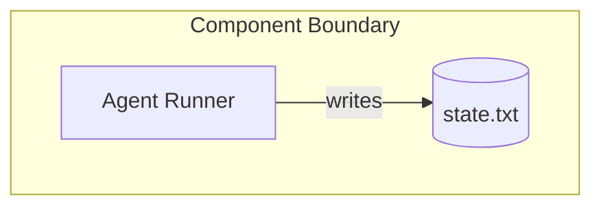

# Technical Reference Document (TRD) — <ADR-ID>: <Title>

* **Status:** Draft
* **Owner(s):** <Tech Lead / Maintainer>
* **Created:** <g_event_created>
* **Last Updated:** <g_event_last_updated>
* **Source ADR:** <ADR-ID>
* **Linked Clarification Record(s):** <ADR-ID_clarification>
* **Trace ID:** <trace_id_trd_template>
* **Vector Clock:** <vector_clock_trd_template>

---

## 1. Executive Summary

_A concise, human-readable synopsis of the ADR decision and why it matters._

## 2. Normative Requirements

_Translate the decision and all clarifications into actionable "MUST / SHOULD / MAY" statements._

Example table:

| # | Requirement | Criticality |
|---|-------------|-------------|
| R1 | The OS **MUST** persist `state.txt` atomically between phases. | MUST |

## 3. Architecture Overview

_Describe the architecture in prose and include a Mermaid diagram stub below._

## 4. Data Flows / Sequence Diagrams

_Sequence diagrams or numbered flows that show how the system behaves._

## 5. Implementation Guidelines

_Practical guidance for engineers: code patterns, libraries, configuration flags, migration steps, etc._

## 6. Test Strategy

_How to validate compliance with this TRD: unit tests, integration tests, chaos tests._

## 7. SLIs / SLOs & Observability

_Define metrics, alert thresholds, dashboards._

## 8. Open Issues & Future Work

_List known gaps, TODOs, or questions that still need addressing._

## 9. Traceability

- adr_source: <ADR-ID>
- clarification_source: <ADR-ID_clarification>
- trace_id: <trace_id_trd_template>
- vector_clock: <vector_clock_trd_template>
- g_document_created: <g_event_created>
- g_document_last_updated: <g_event_last_updated>

---

_Distributed-Systems Protocol Compliance Checklist_

- [ ] Idempotent updates supported
- [ ] Message-driven integration points documented
- [ ] Immutable audit-trail hooks attached 